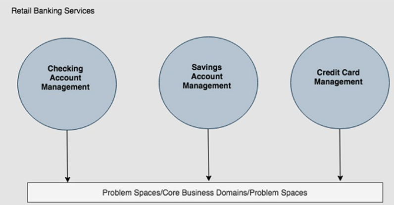
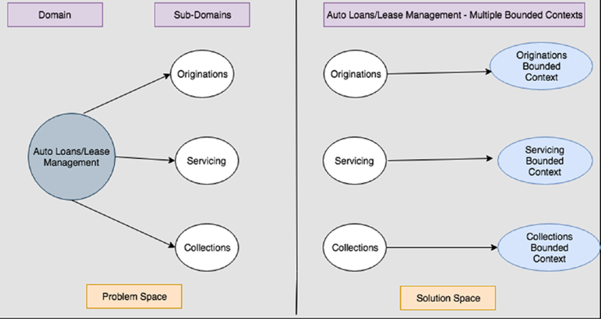
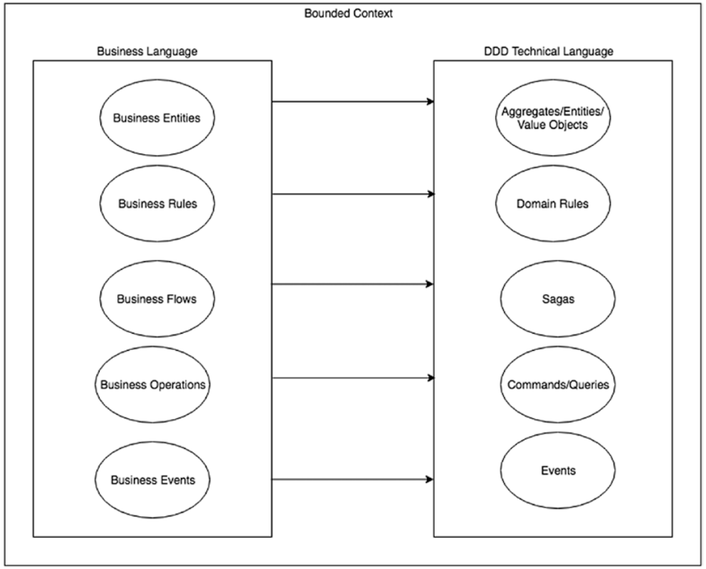
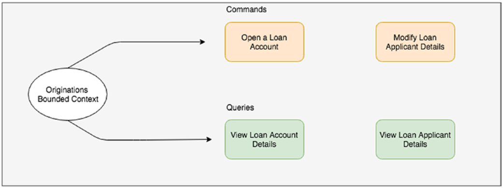
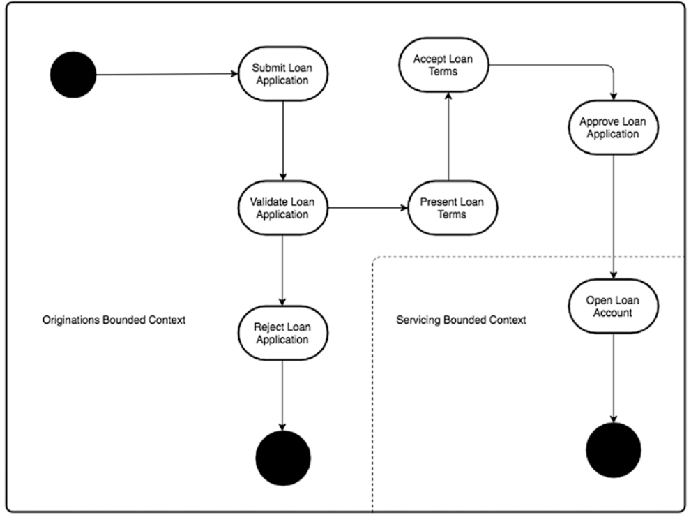

# Domain Driven Sample in Java
- This repository is a short summary of the content from the book [Practical Domain-Driven Design in Enterprise Java (by Vijay Nair](https://www.amazon.com/Practical-Domain-Driven-Design-Enterprise-Java/dp/1484245423))

- Acronym table list:

| **Abbreviations** | **Explainations**        |
|----------------   |-----------------     |
| DDD               | Domain Driven Design |

## Core concepts
- This section provide all domain driven design core concepts:

#### 1. Definition:
> Domain-Driven Design is an approach to software development that centers the development on programming a domain model that has a rich understanding of the processes and rules of a domain. The name comes from a 2003 book by Eric Evans that describes the approach through a catalog of patterns. Since then a community of practitioners have further developed the ideas, spawning various other books and training courses. The approach is particularly suited to complex domains, where a lot of often-messy logic needs to be organized.
[[1]](https://martinfowler.com/bliki/DomainDrivenDesign.htmlhttps://martinfowler.com/bliki/DomainDrivenDesign.html)

#### 2. Core concepts
##### 2.1 Problem Space/Business Domain
- All DDD modeling start with the defining of **problems space (or business domain)**. It identifies the main business problem that you intend to solve using DDD.
- For example, for a retail banking service company, their core problems space will be:
    - Checking account management.
    - Saving account management.
    - Credit card management.

- Another example from corporate banking services, their core problems space may differ from retail banking:
    - Cash management.
    - Trade management.
    - Credit card management.
    

Problem spaces/business domains always invariably translate into the core business propositions that company offer.

##### 2.2 Sub-Domains/Bounded Contexts.
- Once we have identified the main Business Domain, the next step is to break the domain into its sub-domains. The identification of the sub-domains essentially involves the breaking down of the various business capabilities of your main business domain into cohesive units of business functionalities.
- For example, from previous example, the **credit card management problems space** can be divided into:
    - **Products**: This sub-domain takes care of the business capability of managing all types of credit card products.
    - **Billings**: This sub-domain takes care of the business capability of billing for a customer’s credit card.
    - **Claims**: This sub-domain takes care of the business capability of managing any kinds of claims for a customer’s credit card.
    
- When we try to map from problems space to solution space, we define a **bounded context** to define our solution, for example, can we put all the sub-domain the one single bounded context (monolith architect) or each sub domain have their own bounded context (micro-services approach).

- For example, the Auto loan lease management company may have sub domain of: originations, servicing, collections, and they can be bounded co as :

| Monolith       | SOA            |
|----------------|----------------|
| ||

- **Bounded context** from implementation view point can help us with deployment, for example with single bounded context for all sub domain, we can deploy our application a single WAR/JAR file on application server. Or multiple WAR/JAR files in multiple application server or docker container.

##### 2.3 The Domain Model

In business language, this involves identifying
* Business Entities
* Business Rules
* Business Flows
* Business Operations
* Business Events

In technical language within the DDD world, this translates into identifying
* Aggregates/Entities/Value Objects
* Domain Rules
* Sagas
* Commands/Queries
* Events

**Aggregates/Entity Objects/Value Objects**

- The **Aggregate** (also known as the root aggregate) is the central business object within your Bounded Context and defines the scope of consistency within that Bounded context. Every aspect of your Bounded Context begins and ends within your root aggregate.
> Aggregate = Principal identifier of your Bounded Context
- **Entity Objects** have an identity of their own but cannot exist without the root aggregate, that is, they are created when the root aggregate is created and are destroyed when the root aggregate is destroyed.
> Entity Objects = Secondary identifiers of your Bounded Context
- **Value Objects** have no identity and are easily replaceable within an instance of a root aggregate or an entity.
- **Example**:

**Domain Rules**
- **Domain Rules** are pure business rule definitions. Modeled as Objects too, they assist the Aggregate for any kind of business logic execution within the scope of a Bounded Context.

- Within our Originations Bounded Context, a good example of a Domain Rule is a “State Applicant Compliance Validation” Business Rule. The rule basically states that depending upon the “state” of the Loan Application (e.g., CA, NY), additional validation checks could be applicable to the loan applicant.

**Commands/Queries**
-  Commands and Queries represent any kind of operations within the Bounded Context which either affect the state of the aggregate/entity or query the state of the aggregate/ entity.

**Events**
- Events capture any kind of state change either with an aggregate or an entity within the Bounded Context.

**Sagas**
- The final aspect of the DDD model is to flush out any kind of business processes/ workflows within your Business Domain. In the DDD terminology, these are termed as sagas. 
- **Example**:

#### 3. Core concepts
